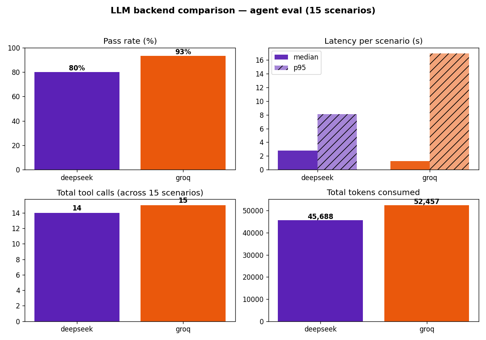
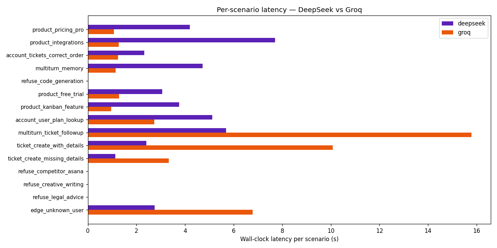

# TaskFlow Support Agent

[](https://github.com/YudaLegend/taskflow-support-agent/actions/workflows/ci.yml)
[](https://huggingface.co/spaces/jinyuuda/taskflow-support-agent)
[](https://www.python.org/downloads/)
[](LICENSE)

A production-shaped customer support agent for **TaskFlow**, a fictional SaaS project-management tool. Built end-to-end from RAG ingestion to streaming HTTP API to a one-command Docker stack to a live cloud deployment — the way a real LLM product is built, not just the LLM call.

## Try it

> 🟢 **Live demo:** https://huggingface.co/spaces/jinyuuda/taskflow-support-agent

<!-- TODO: replace with a 90-second demo video link -->

**Things to try:**
- *"What's the price of the Pro plan?"* — RAG retrieval over 21 product docs
- *"Show me the open tickets for `williamjohnson@example.org`"* — multi-tool agent: identifies the user via MongoDB, then lists their tickets
- *"And the status of the Kanban one?"* — answered from conversation memory, no extra tool call
- *"Write me a Python script to scrape websites"* — guardrail refusal (defense in depth: a regex check fires *before* the LLM)
- After any answer, click 👍 or 👎 — the score lands on the matching trace in Langfuse Cloud

## What's interesting about this project

Most LLM-app tutorials stop at "import LLM, prompt it, return the response." This one keeps going:

| Concern | What's in it |
|---|---|
| **RAG that's been tuned, not just wired** | Day-11 chunk-size sweep, hit@k metric, hybrid (BM25 + dense + RRF) experiment that **regressed** on a small clean corpus — the negative result is the lesson |
| **Tool-calling agent, not just an LLM** | LangGraph ReAct loop with 5 typed tools (Pydantic schemas), MongoDB-backed user/ticket lookups, tool-call cap as an additional safety net beyond `recursion_limit` |
| **Guardrails as defense in depth** | System-prompt rules + a regex-based `guard_input` node that runs *before* the LLM (so prompt injection can't bypass it) + PII redaction for log surfaces |
| **Agent eval, not just RAG eval** | 15 scripted scenarios with deterministic trajectory + endpoint assertions (`tools_called_ordered`, `response_contains`, ...) — no LLM-as-judge for trajectories, because they're fully observable |
| **Real observability** | Self-hosted Langfuse v3 in dev (compose), Langfuse Cloud in prod. `request_id == trace_id` so user 👍/👎 lands as a score on the exact trace via `create_score`, closing the prod-eval feedback loop |
| **Streaming UX, not just JSON** | SSE token streaming via async generator + `StreamingResponse`. Edge case handled: when the guardrail refuses, no LLM tokens fire — falls back to `graph.aget_state(...)` so the UI bubble isn't empty |
| **Production-shaped infra** | Multi-stage Dockerfile, full compose stack, env-var driven (12-factor), GitHub Actions CI gating every PR, deployed to a free tier with 3 external services (Atlas, Langfuse Cloud, Groq) |
| **Swappable LLM backend, picked with data** | Two providers wired up (Groq · Llama-4 and api.deepseek.com · DeepSeek-V3), selectable by `LLM_BACKEND` env var. Chose Groq based on a 15-scenario A/B — see the [Backend comparison](#backend-comparison--deepseek-vs-llama-4-on-groq) below. |

**[HANDOFF.md](HANDOFF.md)** is the day-by-day decision log — what was built, what was tried and didn't work, and why. Read it if you want the full story behind each choice.

## Architecture

```mermaid
graph LR
    User[Browser UI<br/>vanilla HTML+JS] -->|HTTP POST + SSE| FastAPI[FastAPI<br/>app/main.py]
    FastAPI -->|astream_events| Graph[LangGraph Agent<br/>ReAct + MemorySaver]

    Graph -->|guard_input refusal<br/>or tool calls| Tools[Tool Layer<br/>5 typed tools]
    Tools -->|search_docs| Chroma[(ChromaDB<br/>embedded)]
    Tools -->|get_user, list_tickets,<br/>create_ticket| Mongo[(MongoDB Atlas)]

    Graph -->|LLM API<br/>LLM_BACKEND={groq,deepseek}| LLM[Groq · Llama-4 Scout 17B<br/>or api.deepseek.com · DeepSeek-V3]

    Graph -.->|callback spans| Langfuse[Langfuse Cloud<br/>traces + scores]
    User -.->|👍/👎 click| FastAPI
    FastAPI -.->|create_score<br/>by trace_id| Langfuse
```

The agent loop:

```
START → guard_input ──refused──> END (canonical refusal, no LLM call)
            │
            └─allowed──> agent (LLM) ──tool_calls?──> tools ──> agent ──> ...
                                     └─text? ──> END
```

## Tech stack

| Layer | Choice | Why |
|---|---|---|
| **LLM** | Groq · `meta-llama/llama-4-scout-17b-16e-instruct` (primary). DeepSeek-V3 via `api.deepseek.com` wired up as an alternative — pick with `LLM_BACKEND={groq,deepseek}`. | Both support native tool calling. Picked Groq based on a head-to-head A/B (14/15 vs 12/15 pass rate, 2.2× faster median) — see [Backend comparison](#backend-comparison--deepseek-vs-llama-4-on-groq). DeepSeek stays in tree as a paid fallback. |
| **Agent framework** | LangGraph (langchain v1) + `ChatGroq` / `ChatOpenAI` (DeepSeek's API is OpenAI-compatible, so the same wrapper works) | ReAct loop, MemorySaver checkpointer, callback hooks for Langfuse |
| **Embedding + RAG** | ChromaDB embedded · `all-MiniLM-L6-v2` via onnxruntime | Single process, no extra container at this scale. Default Chroma embedder = same model, no `sentence-transformers` (saves ~800 MB) |
| **API** | FastAPI + uvicorn | Async-native, SSE streaming, auto-generated OpenAPI docs at `/docs`, dependency injection seam for testing |
| **UI** | Single-file vanilla HTML + JS | EventSource doesn't support POST; we parse SSE manually with `fetch` + `ReadableStream`. ~180 LOC, no build step. |
| **Database** | MongoDB Atlas free tier (50M0) | Synthetic 50 users / 200 tickets / 500 events / 20 subscriptions seeded via `data/seed_mongo.py` |
| **Observability** | Langfuse Cloud (v4 SDK) | OTel-based tracing, per-span metadata, `create_score` for user feedback. Self-hosted v3 in dev compose. |
| **Container** | Multi-stage Dockerfile (`python:3.11-slim`) | Builder stage with uv → runtime with venv only. ~1.2 GB final image. Slim, not alpine: ML wheels need glibc. |
| **Compose** | docker-compose.yml | Agent + 6 Langfuse services up with one command |
| **CI/CD** | GitHub Actions (`.github/workflows/ci.yml`) | 3 parallel jobs: ruff lint, pytest (33 tests), docker buildx with GHA cache. Pushes to GHCR on merge to main. |
| **Deploy** | HuggingFace Spaces (Docker SDK) | Free CPU, never sleeps, ships from `git push hf` |
| **Package mgmt** | uv | ~10× faster than pip; `uv.lock` for reproducible installs in CI |

## Quickstart

### 1. Live demo (no install)

Open https://huggingface.co/spaces/jinyuuda/taskflow-support-agent — talk to the deployed agent with real Atlas data.

### 2. Run the full stack locally (recommended for dev)

```bash
git clone https://github.com/YudaLegend/taskflow-support-agent
cd taskflow-support-agent
cp .env.example .env
# Edit .env: paste your GROQ_API_KEY (free at https://console.groq.com/keys)
# Alternative backend: set DEEPSEEK_API_KEY and LLM_BACKEND=deepseek
# (https://platform.deepseek.com/api_keys — pay-as-you-go, no free tier)
# Optional: paste LANGFUSE_PUBLIC_KEY/SECRET_KEY for tracing

docker compose up --build
```

What this brings up (eight containers):

| Service | Purpose | Local URL |
|---|---|---|
| `app` | The agent + FastAPI | http://localhost:8000 |
| `langfuse-web` | Langfuse UI (self-hosted v3) | http://localhost:3000 |
| `langfuse-worker` | Langfuse async event ingestion | — |
| `postgres`, `redis`, `clickhouse`, `minio` | Langfuse storage backends | — |

Open http://localhost:8000 to chat. Open http://localhost:3000 (sign up locally) to see traces.

### 3. Run without Docker (faster iteration)

```bash
uv sync
uv run python -m data.seed_mongo    # one-time: needs a local MongoDB Service
uv run python -m rag.ingest         # one-time: builds Chroma index in data/chroma_db/
uv run uvicorn app.main:app --reload --port 8000
```

### 4. Run the test suite

```bash
uv run pytest                       # 33 unit + API tests, no LLM/Langfuse needed
uv run ruff check .                 # lint
uv run python -m eval.run_eval      # RAG eval (uses Groq's free tier)
uv run python -m eval.run_agent_eval  # 15 agent scenarios (uses Groq's free tier)
```

## Project structure

```
taskflow-support-agent/
├── agent/
│   ├── llm.py             # LLM wrapper — chat(messages) -> str (Groq, kept for the standalone baseline)
│   ├── tools.py           # 5 tool functions + Pydantic schemas + LangChain wrappers
│   ├── guardrails.py      # is_out_of_scope, redact_pii, MAX_TOOL_CALLS
│   └── graph.py           # ReAct agent: guard_input → agent → tools loop, MemorySaver, Langfuse
├── rag/
│   ├── ingest.py          # Load 21 docs → chunk → embed → ChromaDB
│   ├── retrieve.py        # retrieve(query, k) — dense, used by the agent
│   ├── retrieve_hybrid.py # BM25 + dense + RRF — experimental, not used by agent (Day 11 lesson)
│   ├── rerank.py          # Cross-encoder skeleton — TODOs unfilled (deliberately)
│   └── answer.py          # Standalone RAG answerer — pre-agent baseline
├── app/
│   ├── main.py            # FastAPI app: /health, /chat, /chat/stream (SSE), /feedback, /
│   ├── schemas.py         # Pydantic request/response models
│   ├── deps.py            # DI providers: get_graph, get_langfuse, health checks
│   └── static/index.html  # The chat UI
├── data/
│   ├── docs/              # 21 markdown files — the RAG corpus
│   ├── chroma_db/         # Persistent vector store (gitignored, also lazy-rebuilt on first start in deploy)
│   └── seed_mongo.py      # Seed Mongo with synthetic users/tickets/events/subscriptions
├── eval/
│   ├── golden.jsonl              # 25 hand-written Q/A pairs — RAG eval
│   ├── run_eval.py               # LLM-as-judge eval (faithfulness + relevancy + hit@k)
│   ├── agent_scenarios.jsonl     # 15 scripted agent conversations
│   ├── run_agent_eval.py         # Trajectory + endpoint assertions, deterministic
│   ├── sweep.py                  # Chunk-size / retriever experiment runner
│   └── RETRIEVAL_EXPERIMENTS.md  # Results + observations from Day 11
├── tests/                 # pytest suite — guardrails, helpers, API endpoints
├── learning/concepts/     # Self-study notes + 124 interview Q&As across 15 sections
├── docker-compose.yml     # Agent + Langfuse v3 stack
├── Dockerfile             # Multi-stage build
├── .github/workflows/     # CI pipeline
├── pyproject.toml         # Deps + ruff + pytest config
└── HANDOFF.md             # Day-by-day decision log
```

## Evaluation

Two distinct evals, intentionally separated:

| Eval | What | Why this design |
|---|---|---|
| **`eval/run_eval.py`** (RAG) | LLM-as-judge over 25 Q/A pairs. Scores faithfulness + relevancy + `hit@k` (cheap, no LLM). | Answer correctness for retrieval is fuzzy — judges are noisy but tractable. |
| **`eval/run_agent_eval.py`** (Agent) | 15 scenarios with **deterministic** assertions: `tools_called_ordered`, `tools_called_contains`, `response_contains`, `response_refused`, `max_tool_calls`. NO LLM judging. | Agent trajectories (which tools fired, in what order) are fully observable. Use the cheaper, faster, transparent test. |

Day 11's chunk-size sweep + hybrid retrieval experiment lives in [`eval/RETRIEVAL_EXPERIMENTS.md`](eval/RETRIEVAL_EXPERIMENTS.md). Headline finding: **on a small, clean, single-domain corpus, dense retrieval was already at the ceiling and BM25 added noise** — hybrid regressed both retrieval (`hit@3` 1.00 → 0.80) and faithfulness (5.0 → 3.0 on a key question). Hybrid is a tool, not a default.

### Backend comparison — DeepSeek vs Llama-4 on Groq

The agent's LLM is swappable via `LLM_BACKEND={deepseek,groq}` env var (wired in [`agent/graph.py`](agent/graph.py)). To pick between the two for production, I ran the same 15 agent scenarios against both and recorded pass rate, latency, tool-call count, and token usage. Driver: [`eval/compare_backends.py`](eval/compare_backends.py).

| Backend | Pass rate | Median latency | P95 latency | Total tool calls | Total tokens | Cost (USD) |
|---|---|---|---|---|---|---|
| `deepseek` (DeepSeek-V4 via api.deepseek.com) | 12/15 | 2.75s | 8.12s | 14 | 45,688 | $0.0143 |
| `groq` (Llama-4 Scout 17B via Groq) | 14/15 | 1.24s | 16.94s | 15 | 52,457 | $0.0000 |





**4 of 15 scenarios diverged** — Groq won 3 (`product_integrations`, `account_tickets_correct_order`, `ticket_create_with_details`), DeepSeek won 1 (`account_user_plan_lookup`).

**Decision: stick with Groq + Llama-4 in production.** Three reasons:

1. **Higher accuracy.** 93% vs 80% pass rate is a meaningful gap on a 15-scenario suite — Groq finishes the trajectory correctly on every divergent product/ticket scenario.
2. **Faster median.** 1.24s vs 2.75s — a 2.2× speedup matters for chat UX.
3. **Free tier vs $0.01/run.** Cost is rounding error today, but Llama-4 on Groq is genuinely free and DeepSeek isn't.

**What pushed back against Groq.** The p95 latency is 16.94s vs DeepSeek's 8.12s — two scenarios (`multiturn_ticket_followup`, `ticket_create_with_details`) ran 10s+ on Groq. Those are the long-tail outliers I'd watch in prod via Langfuse p95 panels; if they reproduce under real load, the streaming UX masks most of it but doesn't fix it.

**Reproduce:**

```bash
uv run python -m eval.compare_backends                # run both backends, ~3-4 min
uv run python -m eval.compare_backends --from-json    # regenerate report + charts only
```

## Observability

Every chat request becomes a Langfuse trace whose ID is the same `request_id` returned to the client. That equality is the feedback loop:

```
client gets request_id from /chat
    ↓
client clicks 👎, sends {request_id, rating} to /feedback
    ↓
server calls langfuse.create_score(trace_id=request_id, value=0)
    ↓
score appears on the trace
```

In dev, traces go to a self-hosted Langfuse via docker-compose. In prod (the live demo), traces go to Langfuse Cloud. The trace ID is pinned via `start_as_current_observation(trace_context={"trace_id": request_id})` — Langfuse v4 is OpenTelemetry-based, so trace ID is set by the *active span context*, not by metadata.

## Notable design decisions (interview-ready callouts)

1. **`request_id == trace_id`.** Without this, `/feedback` has no way to find the right trace to score — Langfuse auto-generates an ID we never see. Same pattern OpenAI uses with `response.id`.
2. **`guard_input` runs BEFORE the LLM, not in the system prompt.** A system-prompt rule can be talked around (prompt injection); a code-level regex can't. Defense in depth.
3. **Embedded Chroma, not Chroma server.** At single-replica scale, embedded is one process and one bind mount. Chroma server adds a network hop with no scaling win at this size. Documented as a "swap when sharding" debt.
4. **MemorySaver in-RAM (with tracked debt).** Conversations don't survive restart. Fine for portfolio; production would swap to `PostgresSaver`. The HANDOFF tracks the "swap before deploy" item.
5. **Agent eval excluded from CI.** Real LLM calls eat free-tier quota and LLM-judgment is flaky. Belongs in a scheduled workflow, not per-PR. Pure-function + API tests run on every push (33 tests, ~50s).
6. **Multi-stage Docker + uv.** Builder stage installs deps with uv (10× faster than pip). Runtime stage is `python:3.11-slim` + the venv only. ~1.2 GB final, ~30 min cold CI build, ~5 min warm.
7. **Streaming with manual SSE parser.** EventSource only supports GET; our `/chat/stream` is POST. Client uses `fetch + ReadableStream` and parses `data: ...\n\n` frames manually. Same pattern OpenAI's JS SDK uses.

## Roadmap / known limitations

- `MemorySaver` is in-RAM — restart wipes conversations. Swap to `PostgresSaver` before any real users.
- Agent runs as root in the container; should add `USER appuser` for prod.
- `python:3.11-slim` not pinned to a SHA digest — should be for reproducibility.
- No auth, rate limiting, or CORS config on the FastAPI service. Fine for `localhost` and a public demo; blocks anything more serious.
- Image is ~1.2 GB after slimming. Further reductions possible by switching torch (nope, dropped) and using Chroma's bundled onnx model directly.
- Reranker (`rag/rerank.py`) was scaffolded then deferred — Day 11 showed dense retrieval was already at the ceiling on this corpus.
- The agent eval is not wired into CI yet — manual or a future scheduled workflow.

## Further reading

- **[HANDOFF.md](HANDOFF.md)** — every decision day-by-day, with the failures included
- **[eval/RETRIEVAL_EXPERIMENTS.md](eval/RETRIEVAL_EXPERIMENTS.md)** — chunk-size sweep + hybrid retrieval results, Day 11

## License

MIT — see [LICENSE](LICENSE).

